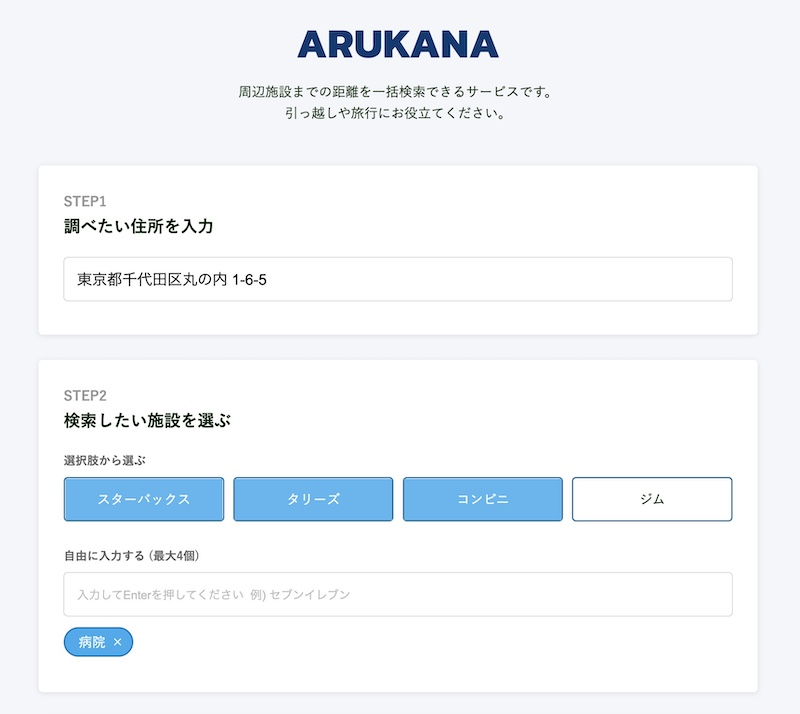
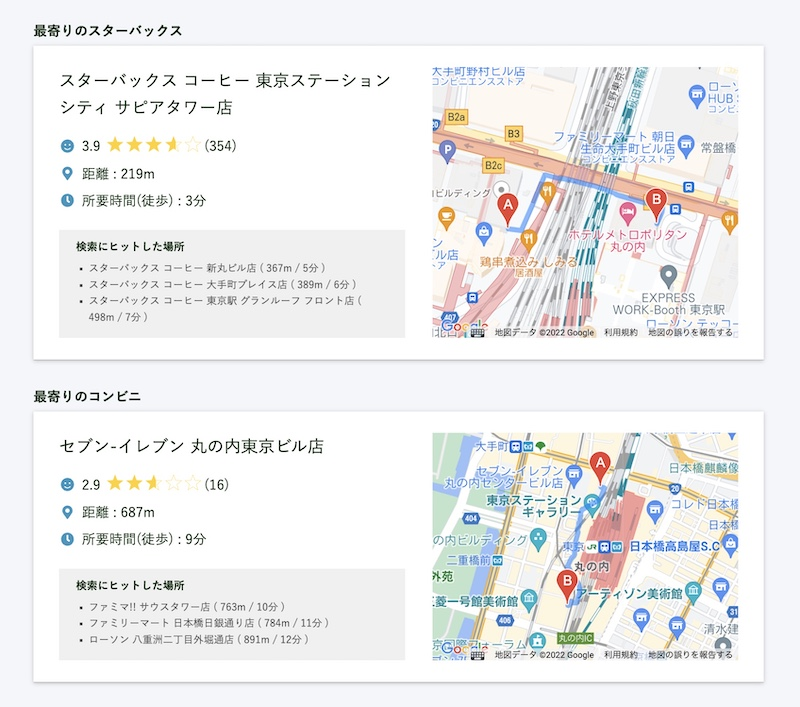

# Arukana

周辺施設までの距離を一括検索できるサービスです。

Site: [https://cerulean-hummingbird-ace5cd.netlify.app/](https://cerulean-hummingbird-ace5cd.netlify.app/)

## Technologies

- React v17.0.2
- TypeScript v5.3.3

## Set up

ルートディレクトリに.envを作成し、必要な環境変数を設定してください。
```
cd arukana
yarn install
yarn start
```

## Capture



